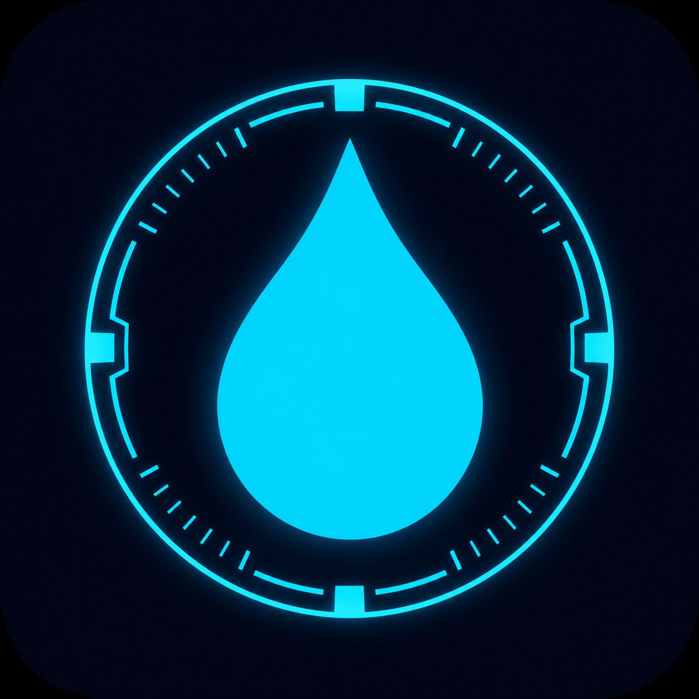

# Hydro Buddy · Your AI Hydration Assistant

> *"Staying hydrated is not optional. Friday won't let you forget."*

  

**Live App →** https://farman024.github.io/Hydro-Buddy/

---

## What It Is

Hydro Buddy is an AI-powered hydration assistant with a personality. Inspired by Friday — Tony Stark's female AI assistant from Iron Man — Hydro Buddy checks in on you throughout the day with voice notifications that remind you to drink water. She doesn't just ping you. She talks to you.

Built for people who get so deep into work they forget they're human.

---

## Meet Friday

  

Friday isn't a notification. She's a presence.

**Who she is** — Friday is Tony Stark's AI assistant from Iron Man, and she's the personality running Hydro Buddy. Calm, intelligent, and slightly dry — but always looking out for you.

**What she does** — She lives on your screen as a draggable avatar. Drag her anywhere; she remembers where she likes to stand. Double-click to reset her home position. Every time you log a glass, she acknowledges it. When you fall behind, she calls you out. When you hit your goal, she calls it — *"Mission complete, Boss."*

**How she talks** — Her voice is generated by the Web Speech API with smart female-voice selection. You control her volume, speech rate, and pitch. She greets you by time of day, checks your pace against your schedule, and unlocks achievements with a spoken announcement.

**Her rules** — She never lets you forget you're human. Hydration is the mission.

---

## Features

- **AI Voice Reminders** — Female voice powered by the Web Speech API, with smart voice selection (prefers female voices), plus adjustable volume, rate, and pitch
- **Two Reminder Modes** — Interval (every 30 min to 3 hours) or Custom Times (add as many specific times as you want), active only within your Start/End hours
- **Pace-Aware Messaging** — Friday reads your progress and reacts: nags you when you're behind, celebrates when you're on track, and calls out mission complete when you hit your goal
- **Time-of-Day Greetings** — Context-aware phrases for morning, afternoon, and evening
- **Arc Reactor Progress Ring** — A circular reactor with orbit dots (one per glass) and a fill ring tracking your daily intake
- **Intake Tracker** — Log each glass, see glasses/ml drunk, remaining count, streak, and average gap between glasses
- **Streak System** — Tracks consecutive days of hitting your hydration goal, plus lifetime best streak
- **Achievements & Badges** — 10 unlockable badges (First Drop, On Fire, Centurion, Night Owl, Speed Runner, etc.) with an SVG icon grid and progress count
- **Weekly PDF Report** — One-tap download of a dark-themed A4 report: last 7 days, daily bar chart, goal line, weekly total, average, best day, and goal-completion percentage — personalized with your name
- **Friday Assistant (Draggable)** — Friday floats on your screen and can be dragged anywhere; position persists across sessions and double-click resets it
- **Desktop + Mobile Notifications** — Push-style reminders with a custom water-drop icon, plus live next-reminder countdown
- **Page Visibility Recovery** — Catches phone wake-from-sleep and re-syncs the reminder timer
- **Personalization** — Your name, daily goal (glasses + ml per glass), voice, and reminder schedule are all configurable
- **Data Export / Import** — Back up and restore your full history, streaks, and badges as JSON
- **PWA** — Installable on mobile and desktop, runs offline with a service worker and manifest

---

## The 10 Badges

| Badge | Requirement |
|---|---|
| First Drop | Log your first glass |
| Day One | Hit your daily goal once |
| On Fire | 7-day streak |
| Iron Hydrator | 30-day streak |
| Centurion | 100 glasses logged |
| Gallon Legend | 500 glasses logged |
| Perfect Week | 7 goal-complete days |
| Early Riser | Log a glass before 6am |
| Night Owl | Log a glass after 10pm |
| Speed Runner | Finish your goal before noon |

---

## Tech Stack

- **Vanilla HTML / CSS / JS** — no frameworks, one file
- **Web Speech API** — voice synthesis for Friday
- **Web Notifications API** — background reminders
- **jsPDF 2.5.1** — weekly hydration report generation
- **Service Worker** — offline PWA caching
- **localStorage** — persistent state, history, and Friday's position

---

## Why It Exists

Most reminder apps feel like alarm clocks. Hydro Buddy feels like a presence. The difference between a notification you dismiss and one you actually respond to is personality. Friday has it.

---

## Built By

**Farman J · AI Generalist** — Bangalore, India  
Solo build. Phone-first. Shipped.
